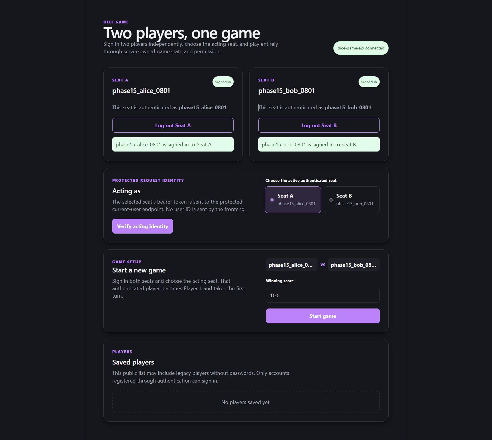
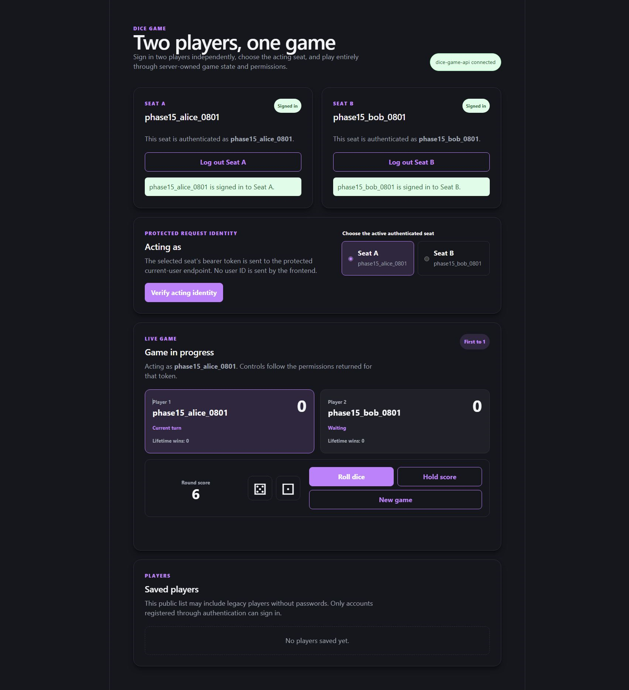
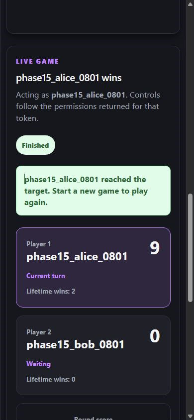

# Dice Game Interview Project

A deployed full-stack, two-player dice game built incrementally as an interview
assignment. The NestJS API owns authentication, authorization, game rules,
concurrency, and persistence; React renders caller-specific server state.

## Live application

- Web: https://dice-game-web-igorm1930.onrender.com
- API health: https://dice-game-api-igorm1930.onrender.com/api/health
- Swagger UI: https://dice-game-api-igorm1930.onrender.com/api/docs
- OpenAPI JSON: https://dice-game-api-igorm1930.onrender.com/api/openapi.json

The Render API uses a free instance and may need 50 seconds or more to wake
after inactivity.

## Features

- Two independent authenticated player sessions on one page
- Argon2id password hashing and validated HS256 JWT authentication
- Backend-derived identity, participant authorization, and turn enforcement
- Server-owned Roll, Hold, double-six, winner, and Restart rules
- MongoDB-persisted users, games, lifetime wins, and resumable game state
- Strong ETags and required `If-Match` versions for mutation concurrency
- Stable API error codes, metadata-only request logging, health endpoints,
  Swagger, and OpenAPI
- Accessible live feedback, keyboard controls, responsive layouts, visible
  focus, touch targets, and reduced-motion support
- Read-only GitHub Actions verification and full-history secret scanning

## Screenshots

### Game setup



### Game in progress



### Mobile winner



## Architecture

```text
React + Vite
  -> public HTTPS API URL
NestJS API
  -> validation -> JWT identity -> participant/turn authorization
  -> pure deterministic game engine
  -> optimistic-concurrency repository
MongoDB Atlas
```

The browser keeps both access tokens and the current game reference only in
React memory. It sends the selected seat's bearer token, never a trusted user
ID. The pure game engine imports no HTTP, database, authentication, or React
code. See [docs/architecture.md](docs/architecture.md) for the complete design
and [docs/api-contracts.md](docs/api-contracts.md) for the API contract.

## Repository

- `api/` - NestJS, TypeScript, Mongoose, JWT, Swagger, and the game domain
- `web/` - React, TypeScript, and Vite
- `.github/workflows/` - CI verification and Gitleaks
- `compose.yaml` - local MongoDB 7.0.39 on `127.0.0.1:27018`
- `render.yaml` - deployed Render API and static site
- `docs/` - architecture, testing, deployment, security, and delivery evidence

## Requirements

- Node.js `20.19.x` or `22.12+`
- npm from the Node.js installation
- Docker for local MongoDB

The committed lockfiles use npm.

## Local setup

Start MongoDB:

```powershell
docker compose up -d mongodb
```

Start the API in one PowerShell window:

```powershell
Set-Location api
npm.cmd ci
$env:NODE_ENV='development'
$env:PORT='3000'
$env:FRONTEND_ORIGIN='http://localhost:5173'
$env:MONGODB_URI='mongodb://127.0.0.1:27018/dice_game'
$diceGameJwtBytes=New-Object byte[] 32
$diceGameJwtRng=[Security.Cryptography.RandomNumberGenerator]::Create()
$diceGameJwtRng.GetBytes($diceGameJwtBytes)
$diceGameJwtRng.Dispose()
$env:JWT_SECRET=[Convert]::ToBase64String($diceGameJwtBytes)
$env:JWT_EXPIRES_IN='30m'
$env:JWT_ISSUER='dice-game-api'
$env:JWT_AUDIENCE='dice-game-web'
npm.cmd run start:dev
```

Start the web app in another PowerShell window:

```powershell
Set-Location web
npm.cmd ci
$env:VITE_API_URL='http://localhost:3000'
npm.cmd run dev -- --host localhost --port 5173 --strictPort
```

Open http://localhost:5173. Swagger is available at
http://localhost:3000/api/docs.

`VITE_API_URL` is intentionally public browser configuration. `MONGODB_URI`
and `JWT_SECRET` are private backend values, must never use a `VITE_` prefix,
and must never be committed. Real `.env` files are ignored.

## Verification

With local MongoDB running:

```powershell
$env:VITE_API_URL='http://localhost:3000'
npm.cmd run verify
Remove-Item Env:VITE_API_URL
```

The root command runs backend and frontend lint, 107 backend unit tests, 43
frontend tests, 50 MongoDB E2E tests, and both production builds. CI repeats
locked installs, dependency audits, verification on Node.js 22, and a separate
full-history Gitleaks scan with read-only permissions.

See [docs/final-verification.md](docs/final-verification.md) for the fresh-clone,
local-browser, GitHub, production, and security evidence.

## Delivery notes

- [Known limitations](docs/known-limitations.md)
- [Interview walkthrough](docs/interview-walkthrough.md)
- [Testing strategy](docs/testing-strategy.md)
- [Deployment](docs/deployment.md)
- [Security policy](docs/security-policy.md)

Phases 1 through 16 are merged and deployed. Phase 16 was merged through pull
request #17 as `81dd742`; required CI passed and both Render services are live
on that merge commit.
